# Automatic generation of Visual Gist using GenAI
One image is a 1000 words! This app puts this saying in to practice. It captures the text of a webpage, and it generates a **visual graph representing the summary of the text**. Taking a glance at this 'Visual Gist', will help you understand the main content without having to actually read the whole webpage. The generated content is a rich visual representation of the text and can be used to enrich the given text. 

## Example Visual Gist
Here is an example Visual Gist summary generated for the [Universal Declaration of Human Rights](https://www.un.org/en/about-us/universal-declaration-of-human-rights). This is a united Nations wepbage talking about the 30 basic human rights. You can read the webpage, but you can also take a look at the following graph that visually explains the same concepts, making it easier to quickly digest more information, in a shorter period of time. The following example was generated with the proposed solution. 

